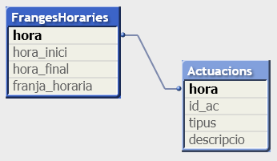

<!-- TOC depthFrom:1 depthTo:6 withLinks:1 updateOnSave:1 orderedList:0 -->
- [**Qlik**](#qlik)
	- [**Qlik View**](#qlik-view)
			- [**Script editor**](#script-editor)	
				- [Càrrega de dades](#crrega-de-dades)
				- [Funcions per modificar camps](#funcions-per-modificar-camps)
				- [Variables](#variables)  				
				- [Calendari](#calendari)
				- [Guardar fitxers QVD](#guardar-fitxers-qvd)
			- [**Gràfics i visualització**](#grfics-i-visualitzaci)
				- [Expresions](#expresions)
					- [Funcions agregació](#funcions-agregaci)
				- [Qualificadors TOTAL i ALL](#qualificadors-total-i-all)
			- [Conjunts de selecció - **Set analysis**](#conjunts-de-selecci-set-analysis)
			- [Seguretat](#seguretat)
		- [**Pàgines amb informació Qlik View**](#pgines-amb-informaci-qlik-view)
- [Qlik Sense](#qlik-sense)

<!-- /TOC -->

# **Qlik**

## **Qlik View**
#### **Script editor**
+ Variables:
```qvs
SET ThousandSep='.';
SET DecimalSep=',';
SET MoneyThousandSep='.';
SET MoneyDecimalSep=',';
SET MoneyFormat='#.##0,00 €;-#.##0,00 €';
SET TimeFormat='h:mm:ss';
SET DateFormat='D/M/YYYY';
SET TimestampFormat='D/M/YYYY h:mm:ss[.fff]';
SET FirstWeekDay=0; //(0=Monday)
SET BrokenWeeks=0;  //(use unbroken weeks - In some years, week 1 starts in December, and in other years, week 52 or 53 continues into January. Week 1 always has at least 4 days in January)
SET ReferenceDay=4; //(set January 4 as the reference day)
SET FirstMonthOfYear=1; // (1=January)
SET CollationLocale='ca-CA';
SET MonthNames='gen.;feb.;mar.;abr.;maig;jun.;jul.;ago.;set.;oct.;nov.;des.';
SET LongMonthNames='gener;febrer;març;abril;maig;juny;juliol;agost;setembre;octubre;novembre;desembre';
SET DayNames='dl.;dm.;dx.;dj.;dv.;ds.;dg.';
SET LongDayNames='dilluns;dimarts;dimecres;dijous;divendres;dissabte;diumenge';
SET NullDisplay='<NULL>'; //nulls de bbdd
SET NullInterpret =''; //will return NULL values for empty cells in Excel  - set NullInterpret=' ';set NullInterpret =;will not return NULL values for empty cells in Excel, but it will for a CSV text file.
SET NullValue='<NULL>';   // If the NullAsValue statement is used, the defined symbol will substitute all NULL values in the NullAsValue specified fields with the specified string. NullAsValue field1, field2;
```

##### Càrrega de dades
+ Càrrega des de bbdd
  ```qvs
   nom_taula:
   LOAD
     camp1,
     camp2;
   SQL SELECT *
   FROM taula;
   ```
  *permet comandes SQL pròpies de la bbdd*
  *les dades de conexió a la bbdd es poden guardar en un fitxer i carregar-lo amb un include: `$(Include=includes\dbconnection.txt);`*  

+ Recàrrega dades de taula ja carregada  - `RESIDENT`
```qvs
   nom_taula2:
   LOAD
     camp1,
     camp2;
   RESIDENT nom taula
   WHERE camp1=34;
```
    *si els camps són els mateixos cal canviar de pestanya*
+ Càrrega dades manual - `INLINE`
```qvs
   nom_taula:
   LOAD * INLINE [
   camp1, camp2
   valor1A, valor2A
   valor1B, valor2B];
   ```
+ Càrrega de dades des d'un altre fitxer QlikView `BINARY LOAD`
   ```qvs
   BINARY arxiu.qvw;  //executar abans dels SET de variables
   ```
+ `QUALIFY` afegeix prefixe amb nom taula -  `UNQUALIFY` elimina el prefixe
+ `DISTINCT` elimina registres duplicats al fer un load. `load distinct`
+ Carrega dades a partir dades just carregades -`Preceding load`       
```qvs
   nom_taula:
   LOAD *
    preu_total * descompte as preu_rebaixat;
   LOAD
    preu_unitari,
    quantitat,
    descompte,
    preu_unitari * quantitat as preu_total;
   SQL SELECT *
   FROM taula;
```
 *permet afegir camps calculats a la taula original*
+ Filtra dades previament carregades - `EXISTS(camponbuscar, qubuscar)`
```qvs
 LOAD
   ciutat,
   provincia;
 RESIDENT taula_ciutats
 WHERE EXISTS(provincia, 'Barcelona');
```
```qvs
multes:
LOAD
   codi,
   infraccio,
   preu,
   data,
   DNI_titular,
   DNI_titular as DNI_multats
FROM [infraccions.xls];
__
poblacio:
LOAD
   DNI,
   nom_ciutada,
   edat,
   sexe;
SQL SELECT *
FROM taula_poblacio;
__
LOAD
 nom_ciutada as nom_infractor,
 edat,
 sexe
RESIDENT poblacio
WHERE EXISTS(DNI_multats, DNI);
```
+ Unió de taules  - `CONCATENATE`
Si es fa la càrrega de dues taules que tenen els mateixos camps, la concatenació és automàtica. Si no tenen els mateixos camps es pot forçar amb CONCATENATE
```qvs
LOAD a, b, c from table1.csv;
CONCATENATE LOAD a, c from table2,csv;
```  

+ Taules diccionari - `MAPPING TABLE`
```qvs
Provincies:
MAPPING LOAD
   CodiProvincia,
   NomProvincia
FROM [provincies_llista.xls]
__
Persones:
LOAD
   nom,
   edat,
   codiprov,
   ApplyMap(Provincies, codiprov, 'sense provincia') as provincia
FROM [persones.xls]
```
 *la taula mapping ha de tenir únicament dos camps, i el primer ha de ser el id*

+ `JOINS`
```qvs
persones:
LOAD
   dni,
   nom
FROM [llista_provincies.xls]
__
left join(persones)
__
feines:
LOAD
   dni,
   data_inici,
   data_final,
   ocupacio
FROM [llista_ocupacios.xls]
```
 *desapareix la taula feines i la taula persones afegeix els seus camps*
 *opcions: left join, join, right join, outer join*

+ Capgirar la taula - `CROSSTABLE` - `Crosstable(NomCampCapgirat, NomCampValors, Núm de files obviar)`
```qvs
SalesTarget:
CrossTable(Year, [Sales Target], 3)
LOAD ProductID,
     EmployeeID,
     CustomerID,
     [2005],
     [2006],
     [2007],
     [2008]
FROM
[..\Data\EmployeeSalesTarget.xls]
(biff, embedded labels, table is SalesTarget$);
```
Genera la taula:
|ProductID|EmployeeID|CustomerID|Year|SalesTarget|    

+ Agregacions - `LOAD DISTINCT` - carrega els registres diferents --> permet agrupar
 ```qvs
 LOAD DISTINCT
    nac as nacionalitat,
    sum(id_persona) as numPersones
 RESIDENT padro
 GROUP BY nac;
 __
 LOAD DISTINCT
   nacionalitat as totsPaisos
 RESIDENT padro;
 ```

+ Aplicar taules diccionari `IntervalMatch`
```qvs
Actuacions:
LOAD * INLINE [
id_ac, tipus, descripcio, hora
1, concert, jazz, 12:40
2, teatre, la familia, 20:30
];
//____
FrangesHoraries:   //les dues primeres columnes del interval han de ser l'inici - final de tram
LOAD * INLINE[
hora_inici, hora_final, franja_horaria
09:00, 14:00, mati
14,00, 20:00, tarda
20:00, 23:00, nit
];
 //interval match ha d'anar seguir de la taula amb els trams
 // (hora inici i hora final). El inner join ens permet connectar-les.
 //El resultat inerval match és unicament, hora, hora_inici, hora_final
Inner Join IntervalMatch(hora)
LOAD hora_inici, hora_final
Resident FrangesHoraries;
```
Resultat:  



+ Busca valors en altres camps `LOOKUP`  
  `lookup('nomCampRecuperar', 'nomCampOnBuscar', valorABuscar, 'nomTaulaonBuscar')`  
    *Els elements de la taula actual van sense cometes, els altres amb cometes.*+

  ```QVS
  ProductCategory:
  LOAD * INLINE[
  Producte, Categoria
  AA, Gran
  BB, Gran
  CC, Petit
  DD, Petit];

  ProductData:
  load*,
    Lookup('Categoria', 'Producte', Product, 'ProductCategory') as categoriaProducte;
  load *,
     UnitSales* UnitPrice as Sales;
  LOAD * inline [
  Customer|Product|UnitSales|UnitPrice
  Astrida|AA|4|16
  Astrida|AA|10|15
  Astrida|BB|9|9
  Betacab|BB|5|10
  Betacab|CC|2|20
  Betacab|DD|25|25
  Canutility|AA|8|15
  Canutility|CC||19
  ] (delimiter is '|');
  ```

  Resultat:  
  


##### Funcions per modificar camps

 - **if(condition, then, else)**  - `if(edat < 18, 'menor', if(edat > 65, 'major', 'adult')) as nivell_edat`
 - **autonumber()** crea un id numèric a partir de l'expressió. L'expressió poden ser camps, si els camps es repeteixen el autonumber serà el mateix. Per evitar això fer servir AutoID.
 `Autonumber(Year&CustomerID) as CustomID`
 - **peek()** recupera el valor d'un camp d'un registre concret: `PEEK(camp, <numfila>, <nomtaula>)` per defecte recupera l'últim valor carregat pel camp indicat (numfila=-1). 0=primer registre, 1= segon registre.
 - **RowNo() i RecNo()** - retorna identificadors correlatius inici al 1. RecNo retorna el id inicialment carregat, RowNo reinical la numeració.
 - Year(), Month(), Day(), Week(), MonthStart()


##### Variables
 + `SET vVariable1 = 1 + 3;` //Value of vVariable1 is 1 + 3
 + `LET vVariable2 = 1 + 3;` //Value of vVariable2 is 4
 + `$(text)` -> permet reeemplaçar el text que conté, per ex. $(=1+3) valdrà 4.
    ```QVS
   SET vRutaFitxer="C:\dades\"
   LOAD *  FROM [$(vRutaFitxer)fitxer.xlsx]
   ```   

##### Calendari
+ Generar el master calendari auxiliar
  + Busquem els límits de la data:
  ```QVS
  RangDates:
  LOAD min(campdata) as MinData,
       max(campdata) as MaxData
  RESIDENT taulaAmbDates;
  __
  LET vMinData = PEEK('MinData', 0, 'RangDates')
  LET vMaxData = PEEK('MaxData', 0, 'RangDates')
  ```
  +Taula temporal calendari:
  ```QVS
  TempCalendari:
  LOAD   
    date($(vMinData)+RowNo()-1) as tempData,
  AutoGenerate($(vMaxData)-$(vMindata)+1);
  ```
  + Taula Calendari -  afegir dades mes, any, ...

##### Guardar fitxers QVD
```qvs
STORE Customers into $(vQVDpath)Customers.qvd;
LOAD * FROM [..\data\Customers.qvd] (qvd);
```

#### **Gràfics i visualització**
##### Expresions
```qvs
· num(sum(patates), "#,##0.00")  //num permet foramtejar el resultat numèric
· count(distinct mongetes)  // mongetes no repetides
· 'hola'&'-'&'com va'&chr(10) //concatenar més salt de línia
. Aggr()
```
###### Funcions agregació
Aquestes funcions agafen **diferents valors d'un camp com entrada i de sortida dónen un únic valor**  --> s'ha de fer agregació per:  **a)** una dimensió, **b)** amb un group by al script o **c)** amb la función `Aggr()`. Crea una taula temporal agregada per després aplicar una funció.
+ Exemple amb aggr `Aggr(NODISTINCT Max(UnitPrice), Customer)`  
Resultat:  

+ Funcions d'agregació  `Sum(), Count(), Min(), Max(), Avg(), Mode(), FirstSortedValue(), Concat(), MaxString()`

##### Qualificadors TOTAL i ALL  
Aquesta qualificadors cal utilitzar-los en una funció d'agregació.
 + `TOTAL` ignorarà la dimensió
 + `ALL` ignorarà la dimensió i les seleccions  
 _Taula de dades exemple:_  
   
 _Resultat ALL i TOTAL_  
    


#### Conjunts de selecció - **Set analysis**
- Només es pot fer servir amb funcions d'agregació
- Consta de Identificadors, Operadors i Modificadors:
  - **Identificadors:** defineixen àmbit del conjunt de selecció
  - **Modificadors:** afegeixen filtres  
  - **Operadors:** permeten interaccions (operacions) entre els conjunts    

    


- **Identificadors**
  - |Identificador|Descripció|  
    |---|---|
    |1|Tots els registres sense tenir en compte seleccions però si la dimensió|
    |$|Tots els registres de la selecció actual. També té en compte la dimensió (és la selecció normal)|
    |$1|Selecció anterior|
    |$\_1|Selecció següent|
    |NomMarcador|Es poden utilitzar noms marcadors|
    |NomEstat|Es poden utilitzar estats alternatius|  
  - Exemples:   
    _Taula de dades exemple:_
       

      


- **Operadors**
  - |Operador|Nom|Exemple|De i scripció|Gràfic|
    |---|---|---|---|---|
    | + |Unió|<[categoria] +={'patata'}>|inclou les categories seleccionades més les patates ||
    | - |Exclusió|<[categoria] -= {'patata'}>|de la selecció d'usuari exclou les de categoria patates||  
    | * |Intersecció|<[categoria] \*= {'patata'}>|exclou totes les categories excepte les patates||
    | / |Diferencia simètrica|<[categoria] \/= {'patata'}>|inclou totes les categories de la selecció excepte les patates||


- **Modificadors**  
Els modificadors permeten modificar el conjunt. Van entre `< >` El forman un o més camps i una selecció sobre aquests camps.   `< NomCamp = {'valor'}>`    
  | Valor | Escriptura|Exemple|
  |---|---|---|
  |string| cometes simples ' ' |`<Ciutat = {'Barcelona'}`>|
  |numèric| sense| `<Codi = {08001}`>|
  |expressió|doble cometes " "|`<Any = {">=2011"}>`|

  + Exemples:
      

  + Exemples2:
   |Expressió        |Descripció|
   |---|---|
   |`Sum({<Year={'2006'}, Product = >}Sales)` |Ignora les seleccions del camp producte|
   |`Sum({<Category = {'C*'} >} Sales)`|Categories que comencen per C|
   |`Sum({$<Year={2009}>+1<Country={'Sweden'}>} Sales)`|Suma de ventes de la selecció actual de l'any i totes(sense tenir en compte la selecció) les de Suècia | `sum( {$<Year = Year + ({“20*”,1997} – {2000}) >} Sales )`|a la selecció actual i afegeix les seleccions d'any, els anys a partir 2000 menys el 2000 i l'any 1997 |
   |`sum( {$<Year = {“*”} – {2000}, Product = {“*AA*”} >} Sales )`|Suma de ventas de la selecció actual, però amb nova selecció en l'any: tots els anys excepte el 2000 i producte AA|


#### Seguretat
+ No permetre binary load  
+ ...   


### **Pàgines amb informació Qlik View**
* [Qlik View CookBook](https://qlikviewcookbook.com/)
* Learn all BI <https://www.learnallbi.com/>
* Qlikfreak <https://qlikfreak.wordpress.com/>


# Qlik Sense
